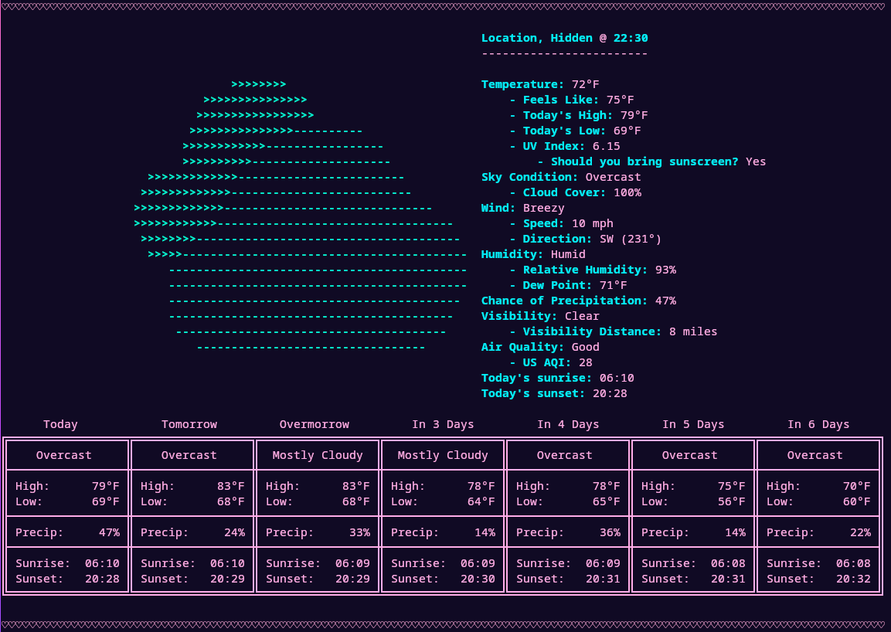

# weatherfetch

neofetch, but weather - A feature-rich weather CLI written in Rust using the Open Meteo API.

dedicated to my weather nerd wife mari <3




## Table of Contents

- [Features](#features)
- [Installation](#installation)
- [Usage](#usage)
- [Custom Arguments](#custom-arguments)
- [Configuration](#configuration)
- [Troubleshooting](#troubleshooting)
- [License](#license)

## Features

- Fetches weather data from the Open Meteo API.
- Automatically detects your location based on your IP address (or from a configured custom location).
- Displays current weather conditions, including temperature, humidity, wind speed, and more.
- Optionally displays a 6-day forecast.
- Customizable output with options for imperial/metric units, colored output, and ASCII icons.
- Custom location support using latitude and longitude.
- Fully configurable via a JSON config file or command-line arguments.
- Cross-platform support (Linux, Windows, MacOS, and any other platforms that support Rust).

## Installation

### With Rust installed

To install weatherfetch with Rust already installed on your system, run:

```bash
cargo install --git https://github.com/tildes1lly/weatherfetch
```

This will work regardless of your operating system.

### Without Rust

If you don't have Rust installed, you can install Rust with an installer or the weatherfetch install script:

#### MacOS, Linux, or other unix like

You can install Rust and weatherfetch using the unix install script:

```bash
curl --proto '=https' --tlsv1.2 -sSf https://raw.githubusercontent.com/tildes1lly/weatherfetch/refs/heads/main/install/install_unix.sh | sh
```

Or, if you don't want to use my install script for whatever reason:

```bash
curl --proto '=https' --tlsv1.2 -sSf https://sh.rustup.rs | sh
cargo install --git https://github.com/tildes1lly/weatherfetch
```

**NOTE: IF YOU CANNOT RUN** `weatherfetch` **AFTER INSTALLING, ADD** `~/.cargo/bin` **TO YOUR *PATH***

#### Windows

Unfortunately, Windows does not have a Rust install script. However, you can still install weatherfetch by doing the following:

Download a [rust installer](https://rustup.rs/), then run:

```bash
cargo install --git https://github.com/tildes1lly/weatherfetch
```

## Updating

To update weatherfetch, simply run the install command again. It will automatically overwrite the old version with the new one.

```bash
cargo install --git https://github.com/tildes1lly/weatherfetch
```

## Usage

Once weatherfetch is installed, it can be ran like so:

```bash
weatherfetch
```

**NOTE: On your first usage, a setup wizard will generate a config file based on your responses.**

### Custom arguments

weatherfetch supports a number of custom arguments (**these will override whatever is set in your config file**)

- `--hide-location` / `--show-location`. Hides or shows your location in the header.
- `--use-imperial` / `--use-metric`. Whether to use imperial units or metric.
- `--no-color` / `--color`. Whether or not the output should be colored.
- `--no-icon` / `--icon`. Whether or not to show an ASCII icon next to the weather results.
- `--show-forecast` / `-f`. Show the forecast of the next six days. Can be enabled by default in the config file.
- `--hide-forecast`. Hides the forecast if you have `"forecast": true` in your config.
- `--lat`. Set a custom latitude to fetch the weather from. **YOU MUST ALSO SET A LONGITUDE VALUE VIA `--lon`**
- `--lon`. Set a custom longitude to fetch the weather from. **YOU MUST ALSO SET A LATITUDE VALUE VIA `--lat`**

#### Using arguments

If you do not know how to use custom arguments, you can use them by appending the argument to the weatherfetch command like so:

```bash
weatherfetch --show-location --use-imperial --no-color --icon --show-forecast --lat 41.482 --lon -82.683
```

## Configuration

On your first usage, weatherfetch will prompt you with options and then generate a config file. If you would like to change it, you can find the file at `~/.config/weatherfetch/config.json` on Linux and `%APPDATA%\weatherfetch\config.json` on Windows. God spare your soul if you want to find the config file on MacOS. Mari said hers was at `~/Library/Application Support/weatherfetch/config.json`. Yours may or may not be there, I have no idea.

The config file should look something like:

```json
{
  "hide_location": true,
  "use_imperial": true,
  "use_color": true,
  "no_icon": false,
  "forecast": false,
  "custom_location": null
}
```

Each field in the config is the equivalent a custom argument, see [Usage](#usage) for more info. You are welcome to manually edit this config file whenever you'd like, but be mindful of the fact that weatherfetch will invalidate the config file if it is not properly formatted or lacks certain fields. If you want to set a custom location, you can replace `null` with an object like so:

```json
{
  "hide_location": true,
  "use_imperial": true,
  "use_color": true,
  "no_icon": false,
  "forecast": false,
  "custom_location": {
    "lat": 41.482,
    "lon": -82.683
  }
}
```

## Troubleshooting

### Incorrect location

weatherfetch uses your IP address to determine your location. If you are using a VPN, proxy, or have an ISP that routes traffic in a weird way, weatherfetch may get your location wrong. To fix this, you can set a custom location in the config file or by using the `--lat` and `--lon` arguments. See Configuration and Usage for more info.

### Broken config file

There are two possible reasons for this. The simplest one is that you updated weatherfetch to a commit before version v1.1.1. Versions v1.1.1 and above fix the issues with the config file breaking on update via rerunning the setup wizard. Updating weatherfetch should fix this issue, if that doesn't work or you do not want to update, you can delete the config file and rerun weatherfetch to generate a new one. The other is that you manually edited the config file and made a formatting error. If this is the case, you can either fix the formatting error or delete the config file and rerun weatherfetch to generate a new one.

If you are having other issues with weatherfetch, please open an issue on the [GitHub repository](https://github.com/tildes1lly/weatherfetch/issues).

## License

weatherfetch is licensed under GNU GPL V3.0.
