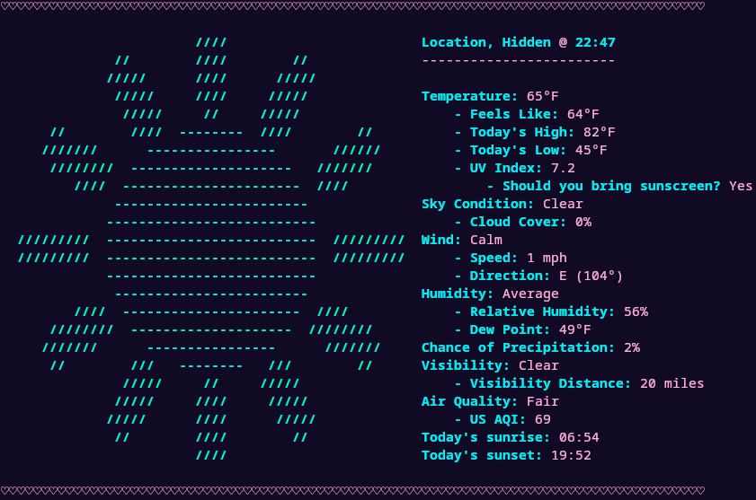

# weatherfetch

neofetch, but weather - A weather CLI written in Rust using the Open Meteo API.

<br>

## Installation

### With Rust installed

To install weatherfetch with Rust already installed on your system, run:

```bash
cargo install --git https://github.com/tildes1lly/weatherfetch
```
<small>This will work regardless of your operating system</small>

### Without Rust

If you don't have Rust installed, you can install Rust with an installer or the weatherfetch install script:

#### MacOS, Linux, or other unix like

You can install Rust and weatherfetch using the unix install script:

```bash
curl --proto '=https' --tlsv1.2 -sSf https://raw.githubusercontent.com/tildes1lly/weatherfetch/refs/heads/main/install/install_unix.sh | sh
```

Or, if you don't want to use my install script for whatever reason:

```bash
curl --proto '=https' --tlsv1.2 -sSf https://sh.rustup.rs | sh
cargo install --git https://github.com/tildes1lly/weatherfetch
```

#### Windows

Unfortunately, Windows does not have a Rust install script. However, you can still install weatherfetch by doing the following:

Download a [rust installer](https://rustup.rs/), then run:

```bash
cargo install --git https://github.com/tildes1lly/weatherfetch
```

## Usage

Once weatherfetch is installed, it can be ran like so:

```bash
weatherfetch
```

**NOTE: On your first usage, a setup wizard will generate a config file based on your responses.**

### Custom arguments

weatherfetch supports a few custom arguments (**these will override whatever is set in your config file**)

- `--hide-location` / `--show-location`. Hides or shows your location in the header.
- `--use-imperial` / `--use-metric`. Whether to use imperial units or metric.
- `--no-color` / `--color`. Whether or not the output should be colored.
- `--no-icon` / `--icon`. Whether or not to show an ASCII icon next to the weather results.

#### Usage

If you do not know how to use custom arguments, you can use them by appending the argument to the weatherfetch command like so:

```bash
weatherfetch --show-location --use-imperial --no-color --icon
```

## Configuration

On your first usage, weatherfetch will prompt you with options and then generate a config file. If you would like to change it, you can find the file at `~/.config/weatherfetch/config.json` on Linux and MacOS and `%APPDATA%\weatherfetch\config.json` on Windows.

The config file should look something like:

```json
{
  "hide_location": true,
  "use_imperial": true,
  "use_color": true,
  "no_icon": false,
  "custom_location": null
}
```

Each field in the config is the equivalent a custom argument, see Usage for more info. <br>
**NOTE: The custom_location field is currently unsupported and changing it will do literally nothing.**

## License

weatherfetch is licensed under GNU GPL V3.0.
